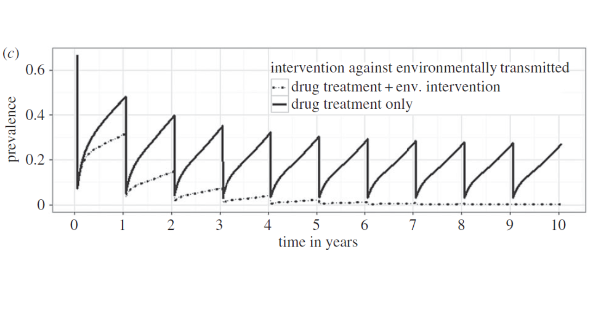

```{r setup, include=FALSE}
knitr::opts_chunk$set(echo = TRUE, warning = FALSE, message = FALSE)
```

Neglected tropical diseases (NTDs) tend to be diseases of poverty that thrive in tropical, disadvantaged communities that often lack access to basic amenities such as clean water, sanitation, and healthcare. They are generally environmentally mediated meaning that some component of their transmission cycle depends on the environment (e.g. a vector, intermediate host, or free-living environmental stage). Control of NTDs generally relies on the administration of drugs that cure individuals from the disease and may confer short-term immunity. However, following drug administration, people are often reinfected by the environmental stage(s) of the pathogen that persist through mass drug administration (MDA) campaigns. Additional interventions that target these environmental reservoirs are often available, but underutilized due to their indirect effects on improving individuals' health.

Using a simple, generalizable model of NTD transmission presented in [Garchitorena et al](http://rstb.royalsocietypublishing.org/content/372/1722/20160128), two interventions will be considered: 1) drug administration, implemented as a pulse reduction in the state variable, $I$, that reduces the prevalence of the disease in the population and 2) environmental remediation (e.g. improvement in sanitation, vector control), implemented as a permanent alteration of a model parameter, that reduces the transmission of the disease. 

The first goal is to code the model and reproduce Figure 3c (below) from [Garchitorena et al](http://rstb.royalsocietypublishing.org/content/372/1722/20160128) comparing the effects of interventions that only target infected people, such as mass drug administration (MDA), to the effects of combined interventions that target infected people and the environment, such as sanitation, mosquito spraying, mollusciciding, etc.



The model consists of two state variables, $I$ and $W$, that correspond to the prevalence of infection in the human population and the degree of contamination of the environment with the disease-causing agent, respectively. The model equations are:

$$\frac{dI}{dt}=(\beta_EW+\beta_DI)S-\gamma I $$

$$\frac{dW}{dt}=\Omega+V\sigma\lambda I-\delta W $$

with variable definitions in table 1 below